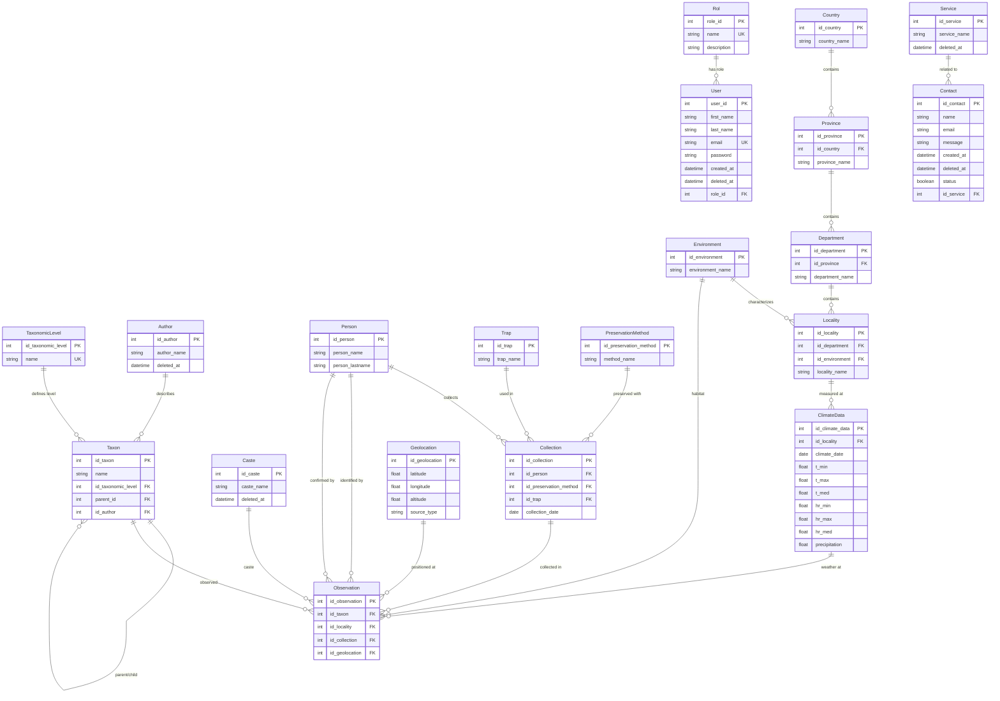

# Modelo de Datos GEMA - Diagrama ER

## Descripción del Modelo

### 🔐 **Sistema de Autenticación**
- **User**: Usuarios del sistema con roles específicos
- **Rol**: Diferentes niveles de acceso (admin, investigador, etc.)

### 🧬 **Sistema Taxonómico**
- **TaxonomicLevel**: Niveles jerárquicos (Reino, Phylum, Clase, Orden, Familia, etc.)
- **Taxon**: Entidades taxonómicas con estructura jerárquica padre/hijo

### 🌍 **Sistema Geográfico**
- **Country → Province → Department → Locality**: Jerarquía administrativa
- **Environment**: Tipos de ambiente/hábitat (Montado, Selva riparia, etc.)
- **Geolocation**: Coordenadas GPS precisas

### 🔬 **Sistema de Colección**
- **Person**: Recolectores/investigadores
- **Trap**: Tipos de trampas utilizadas
- **PreservationMethod**: Métodos de conservación
- **Collection**: Evento de recolección específico

### 👁️ **Sistema Central de Observaciones**
- **Observation**: Registro central que conecta todos los sistemas
  - Qué se observó (Taxon)
  - Dónde (Locality + Geolocation)
  - Cómo fue recolectado (Collection)
  - En qué ambiente (Environment via Locality)

### 📞 **Sistema de Contacto**
- **Service**: Servicios ofrecidos por GEMA
- **Contact**: Consultas y solicitudes de usuarios

## Características Clave

### 🔗 **Relaciones Importantes**
1. **Taxon**: Auto-referencial para jerarquía taxonómica
2. **Observation**: Tabla central que conecta taxonomía, geografía y colección
3. **Locality**: Conecta geografía administrativa con ambiente
4. **Geolocation**: Opcional - no todas las observaciones tienen coordenadas

### 📊 **Cardinalidades**
- **1:N** - La mayoría de relaciones (un país tiene muchas provincias)
- **0:N** - Relaciones opcionales (observación puede no tener geolocalización)
- **Auto-referencial** - Taxon para jerarquía taxonómica

### 🎯 **Puntos Focales**
- **Observation** es la entidad central
- **Environment** recién agregado (Sep 2025)
- **Sistema híbrido**: Prisma para consultas, SQL functions para transacciones complejas
